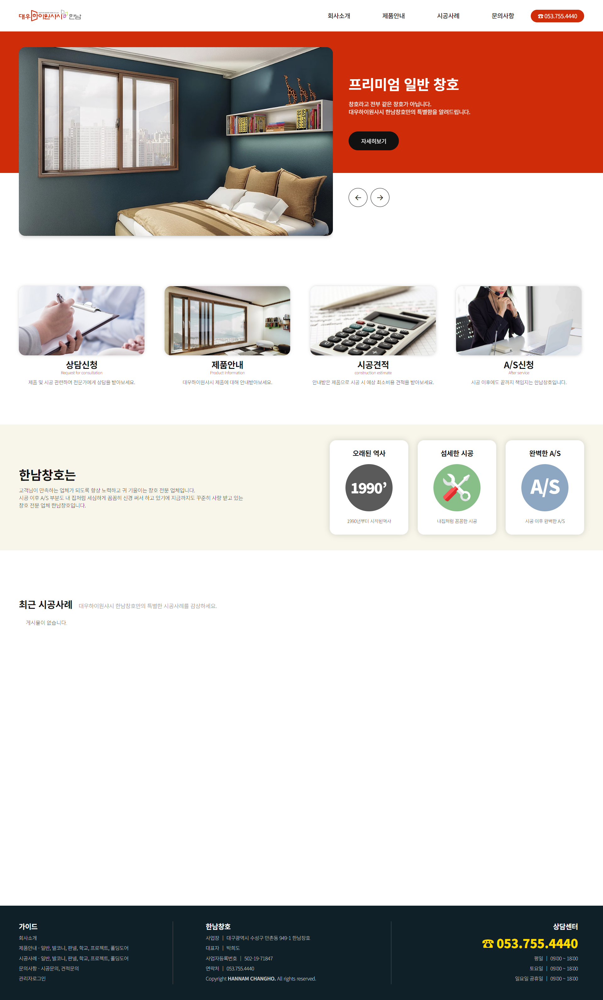
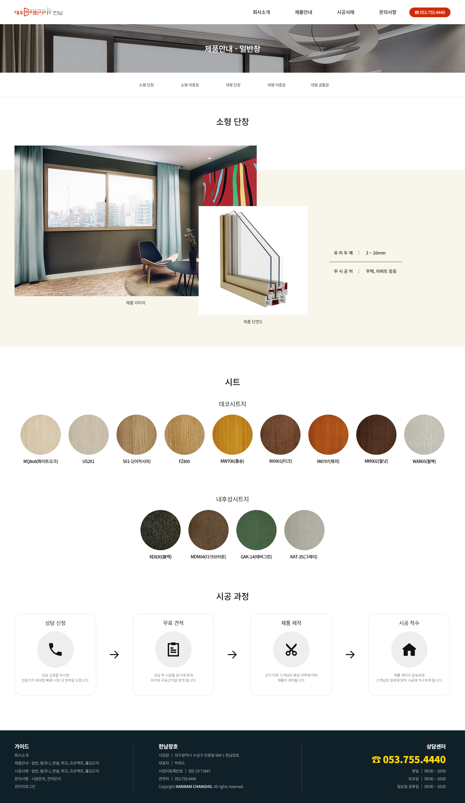
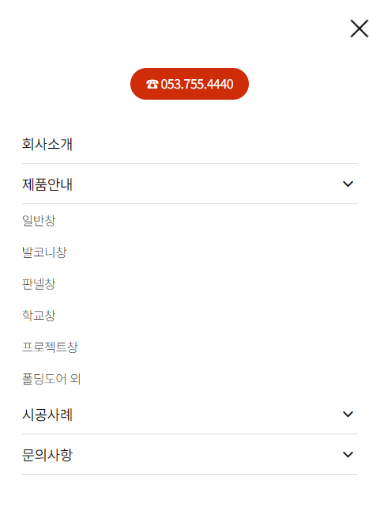
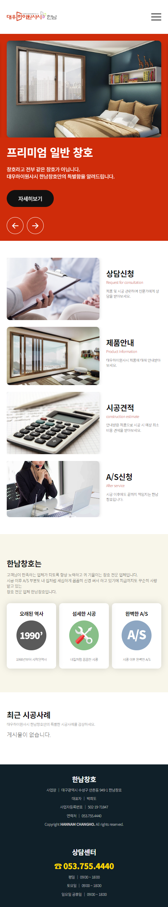
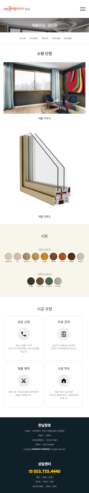

# dwhannam
대우하이원샤시 한남창호 반응형 웹페이지

메인 비쥬얼 부분 슬라이더 커스텀 하여 두개의 슬라이더가 하나의 버튼의 반응하여 동시 움직이도록 구현했습니다.

메인 레이아웃 헤더 부분 mid nav 는 아래 스크롤 진행되면 고정 되도록 구현했습니다.

반응형 페이지
max-width 768px

input radio 속성 사용으로 펼치기 메뉴 사용시 해당 메뉴에 집중할수 있도록 하였으며, 메뉴 진입시 사용자가 착각 하지 않도록 유도하였습니다.

[방문하기](https://dwhannam.com)